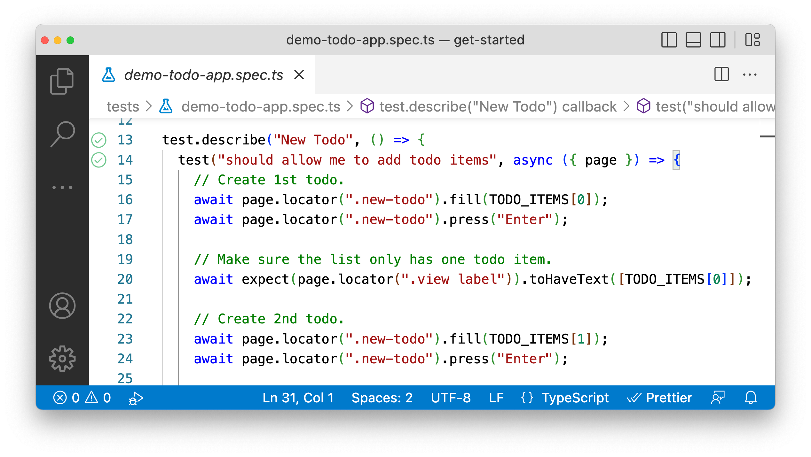
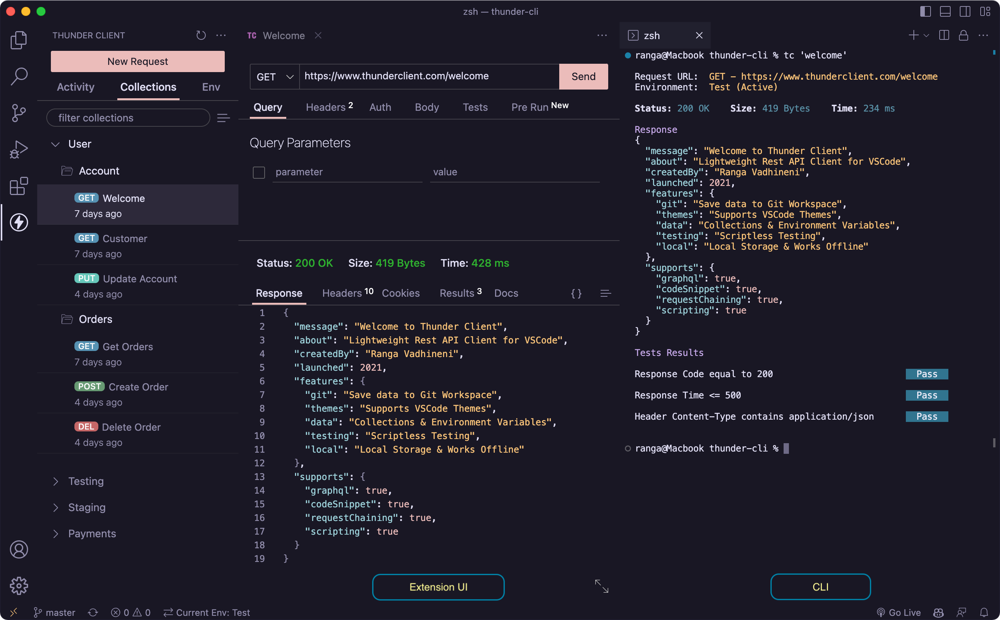

# Project pwSwaggerPetstore

## Instalation

### Создаем репозиторий на GitHub

* Создаем репозиторий на Github
* Привязываем локальный репозиторий к только что созданному на Github

```bash
echo "# pw_api_reqres" >> README.md
git init
git add README.md
git commit -m "first commit"
git branch -M main
git remote add origin << Your repository >>
git push -u origin main
```
* добавляем файл ```.gitignore```

### Устанавливаем Playwright


```bash
npm init playwright@latest
```

Выбираем следующие параметры:

* Typescript
* tests
* n (We don't need a GitHub actions file yet.)
* n (We don't need the browsers, we're testing the API!)


### Устанавливаем дополнительные модули

**[dotenv](https://github.com/motdotla/dotenv#readme)** - для работы с переменными окружения:
```bash
npm install dotenv --save
```
**[@faker-js/faker](https://github.com/faker-js/faker#readm)** - библиотека для генерации фейковых данных для тестов:
```bash
npm install --save-dev @faker-js/faker
```

**[ajv](https://www.npmjs.com/package/ajv)** - библиотека для валидации JSON-схем:
``` bash
npm install ajv --save-dev
```
**[apidevtools/swagger-parser]()** - умеет заменять внутри JSON указатель $ref на фактический JSON-объект

```bash
npm install @apidevtools/swagger-parser --save-dev
```


### Установка плагинов для VS CODE

**[Playwright Test for VSCode](https://marketplace.visualstudio.com/items?itemName=ms-playwright.playwright)** - Запуск и отладка тестов из VS Code




**[Клиент Thunder для VS Code](https://marketplace.visualstudio.com/items?itemName=rangav.vscode-thunder-client&ssr=false#review-details/)** - альтернатива Postman




### Установка и настройка ESLint && Prettier && Husky
Хороший пример  [тут](https://playwrightsolutions.com/the-definitive-guide-to-api-test-automation-with-playwright-part-8-adding-eslint-prettier-and-husky/)

#### ESLint ([typescript-eslint](https://typescript-eslint.io/getting-started))

Установка:
```
npm install --save-dev @typescript-eslint/parser @typescript-eslint/eslint-plugin eslint typescript
```

Настройки выполняются в файлах

* ```.eslintrc.cjs``` - основные настройки
* ```.eslintignore``` - добавление исключений

Варинты запуска:
* Только проверка без исправлений:
```
npx eslint .
```

* С исправлением ошибок:
```
npx eslint . --fix
```


* Как отключить ESLint для некоторых строк, файлов или папок - [тут](https://learn.coderslang.com/0023-eslint-disable-for-specific-lines-files-and-folders/)

#### Prettier
[Documentation](https://prettier.io/docs/en/install)

**ВАЖНО !!!**

Чтобы не испортить форматирование при просмотре чужого кода, в глобальных настройках VS Code добавляем строчку ```"prettier.requireConfig": true,```
В этом случае Prettier будет выполнять форматирование кода, только при наличии в корне проекта своего фала настроек.


Отключает настройки ESLint, конфликтующие с Prettier
```bash
npm install --save-dev eslint-config-prettier
```
Установка:
```bash
npm install --save-dev --save-exact prettier
```
Настройки выполняются в файлах

```.prettierrc``` - основные настройки
```.prettierignore``` - добавление исключений


Варианты запуска
* Проверка без исправления:
```bash
npx prettier . --check
```

* Проверка и исправление ошибок
```
npx prettier . --write
```

#### Husky
[Documentation](https://typicode.github.io/husky/get-started.html)

Установка:
```bash
npx husky-init && npm install
```

Настройки в файле ```.husky/pre-commit```, в него необходимо добавить строку ```npm run lint && npm run prettier```

Если все таки нужно срочно закоммитить не зависимо от наличия ошибок:
```git commit -m "forcing the commit" --no-verify```


## Написание кода (основные моменты)
